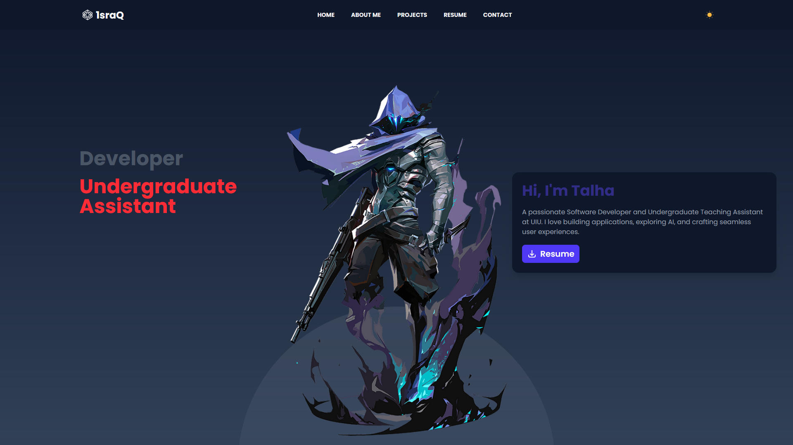

# 🌐 Portfolio Website - israq.tech

Welcome to my portfolio website repository! 🚀

## 🔗 Live Website
You can visit it live here at [israq.tech](https://www.israq.tech/)

## 📌 About the Project
This repository contains the source code for my personal portfolio website, where I showcase my skills, projects, and experiences.

## 🛠️ Tech Stack
- **HTML** - Structure of the website
- **Tailwind CSS** - Styling and layout
- **JavaScript** - Interactive features

## 🎯 Features
- 💼 **Projects Section** - Showcases my personal and professional projects
- 📄 **Resume** - Downloadable resume for recruiters
- 📩 **Contact Form** - Visitors can send messages directly from the site
- 🌑 **Dark Mode** - Dark Mode option for better readability

## 📸 Screenshots


## 🚀 Getting Started
To run this project locally, follow these steps:

### Prerequisites
- A web browser

### Installation
```bash
git clone https://github.com/fatin-israq/portfolio.git
cd portfolio
open index.html
```

## 📬 Contact
Feel free to reach out!
- **GitHub:** [@fatin-israq](https://github.com/fatin-israq)
- **Website:** [israq.tech](https://israq.tech)

---

⭐ If you like this project, don't forget to **star** the repository!
